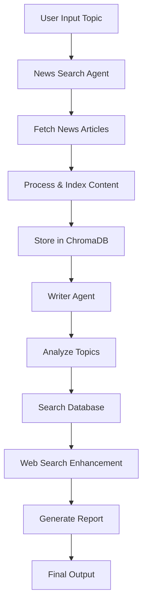

# News Analyser RAG Agent

A sophisticated multi-agent news analysis system built with CrewAI that automatically fetches, processes, and analyzes news articles on any topic using AI agents with intelligent rate limiting and quota management.

## 🚀 Features

- **Multi-Agent Architecture**: Two specialized AI agents working together
  - **News Searcher Agent**: Fetches and indexes news articles
  - **Writer Agent**: Analyzes and summarizes information
- **Intelligent Rate Limiting**: Advanced quota management for Google APIs
- **Vector Database Storage**: Uses ChromaDB for efficient news storage and retrieval
- **Interactive Topic Selection**: User-friendly topic input system
- **Robust Error Handling**: Automatic retry mechanisms with exponential backoff
- **Web Search Integration**: Enhanced with Google Serper API for comprehensive research

## 🏗️ Architecture

```
├── agents.py          # AI agent definitions
├── config.py          # Configuration and custom LLM/embedding classes
├── crew.py           # Main crew orchestration and execution
├── tasks.py          # Task definitions for agents
├── tools.py          # Custom tools for news fetching and searching
└── test.py           # For testing purposes
```

## 📋 Prerequisites

- Python 3.8+
- Google AI API Key (Gemini)
- News API Key
- Serper API Key (for web search)

## 🛠️ Installation

1. **Clone the repository**
   ```bash
   git clone https://github.com/naakaarafr/News-Analyzer-RAG-Agent.git
   cd News-Analyzer-RAG-Agent
   ```

2. **Install dependencies**
   ```bash
   pip install crewai langchain langchain-google-genai langchain-community
   pip install chromadb requests python-dotenv
   ```

3. **Set up environment variables**
   
   Create a `.env` file in the project root:
   ```env
   GOOGLE_API_KEY=your_google_ai_api_key_here
   NEWSAPI_KEY=your_newsapi_key_here
   SERPER_API_KEY=your_serper_api_key_here
   ```

## 🔑 API Keys Setup

### Google AI API Key (Required)
1. Visit [Google AI Studio](https://ai.google.dev/)
2. Create a new API key
3. Copy the key to your `.env` file

### News API Key (Required)
1. Sign up at [NewsAPI.org](https://newsapi.org/)
2. Get your free API key
3. Add it to your `.env` file

### Serper API Key (Optional - for enhanced web search)
1. Sign up at [Serper.dev](https://serper.dev/)
2. Get your API key
3. Add it to your `.env` file

## 🚀 Usage

### Basic Usage

Run the main script and follow the interactive prompts:

```bash
python crew.py
```

The system will:
1. Ask you to enter a topic for analysis
2. Confirm your topic selection
3. Execute the news analysis workflow
4. Provide a comprehensive report

### Programmatic Usage

```python
from crew import run_news_analysis

# Analyze news for a specific topic
result = run_news_analysis("artificial intelligence developments")
print(result)
```

### Command Line Usage

```bash
python crew.py "climate change technology"
```

## 🏛️ System Components

### Agents

#### News Searcher Agent
- **Role**: News Searcher
- **Goal**: Generate key points from latest news articles
- **Tools**: News database search tool
- **Capabilities**: Fetches, processes, and indexes news content

#### Writer Agent  
- **Role**: Writer
- **Goal**: Comprehensive topic analysis and summarization
- **Tools**: News retrieval tool, web search tool
- **Capabilities**: Analyzes topics, verifies information, creates detailed reports

### Tools

#### News DB Tool (`search_news_db`)
- Fetches articles from News API
- Processes content using web scraping
- Creates vector embeddings for semantic search
- Stores in ChromaDB for efficient retrieval

#### Get News Tool (`get_news`)
- Searches the local ChromaDB database
- Retrieves relevant articles based on semantic similarity
- Provides contextual information to agents

#### Search Tool (`search_tool`)
- Performs web searches using Google Serper API
- Enhances research with real-time information
- Provides additional context beyond news articles

### Rate Limiting & Quota Management

The system includes sophisticated quota management:

- **QuotaAwareLLM**: Custom LLM wrapper with intelligent retry logic
- **QuotaAwareEmbeddings**: Embedding wrapper with rate limiting
- **RateLimitedTool**: Base class for tools with built-in rate limiting
- **Exponential Backoff**: Progressive delays for API quota errors
- **Proactive Rate Limiting**: Prevents quota exhaustion before it happens

## ⚙️ Configuration

### Key Configuration Options (config.py)

```python
# Rate limiting settings
requests_per_minute = 6  # LLM requests
embedding_requests_per_minute = 8  # Embedding requests

# News API settings
pageSize = 2  # Articles per request (conservative)
language = 'en'  # English articles only

# Retry settings
max_quota_retries = 5  # Maximum retry attempts
base_retry_delay = 30  # Base delay in seconds
max_retry_delay = 300  # Maximum delay (5 minutes)
```

### ChromaDB Settings

- **Database Path**: `./chroma_db`
- **Chunk Size**: 600 characters
- **Chunk Overlap**: 50 characters
- **Similarity Search**: Top 3 results

## 🔧 Troubleshooting

### Common Issues

1. **API Quota Exceeded**
   ```
   Solution: The system automatically handles this with progressive delays.
   Wait for the countdown to complete or upgrade your API plan.
   ```

2. **No Articles Found**
   ```
   Solution: Try broader search terms or check News API status.
   ```

3. **Database Not Found**
   ```
   Solution: Run the News DB Tool first to populate the database.
   The system will automatically create the database on first run.
   ```

4. **Environment Variable Errors**
   ```
   Solution: Ensure all required API keys are set in your .env file.
   ```

### Performance Tips

1. **Reduce API Calls**: Lower `pageSize` in config for faster execution
2. **Use Specific Topics**: More specific topics yield better results
3. **Monitor Quotas**: Check your API usage regularly
4. **Optimize Timing**: Run during off-peak hours for better API performance

## 📊 System Workflow



## 🤝 Contributing

1. Fork the repository
2. Create a feature branch (`git checkout -b feature/amazing-feature`)
3. Commit your changes (`git commit -m 'Add amazing feature'`)
4. Push to the branch (`git push origin feature/amazing-feature`)
5. Open a Pull Request

## 📝 License

This project is licensed under the MIT License - see the [LICENSE](LICENSE) file for details.

## 🙏 Acknowledgments

- [CrewAI](https://github.com/joaomdmoura/crewAI) for the multi-agent framework
- [LangChain](https://github.com/langchain-ai/langchain) for the foundation tools
- [Google AI](https://ai.google.dev/) for the Gemini API
- [NewsAPI](https://newsapi.org/) for news data
- [Serper](https://serper.dev/) for web search capabilities

## 📧 Contact

**naakaarafr** - [@naakaarafr](https://github.com/naakaarafr)

Project Link: [https://github.com/naakaarafr/News-Analyzer-RAG-Agent](https://github.com/naakaarafr/News-Analyzer-RAG-Agent)

---

### 🔄 Recent Updates

- **v1.0**: Initial release with basic news analysis
- **v1.1**: Added intelligent rate limiting and quota management
- **v1.2**: Enhanced error handling and user experience
- **v1.3**: Integrated web search capabilities with Serper API

### 🛣️ Roadmap

- [ ] Support for multiple languages
- [ ] Real-time news monitoring
- [ ] Enhanced visualization dashboard
- [ ] Integration with additional news sources
- [ ] Sentiment analysis capabilities
- [ ] Export functionality (PDF, Word, etc.)

---

*Built with ❤️ by naakaarafr using CrewAI and LangChain*
